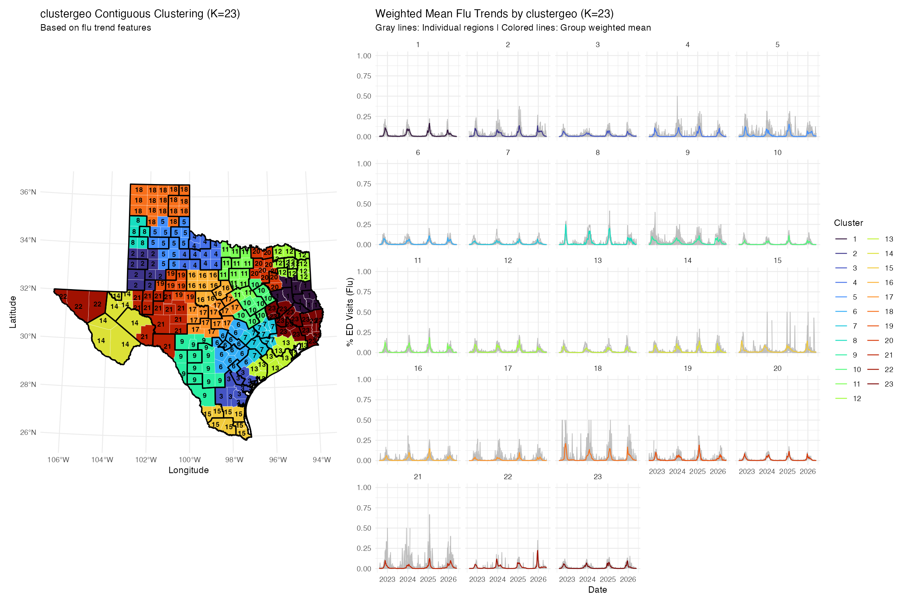
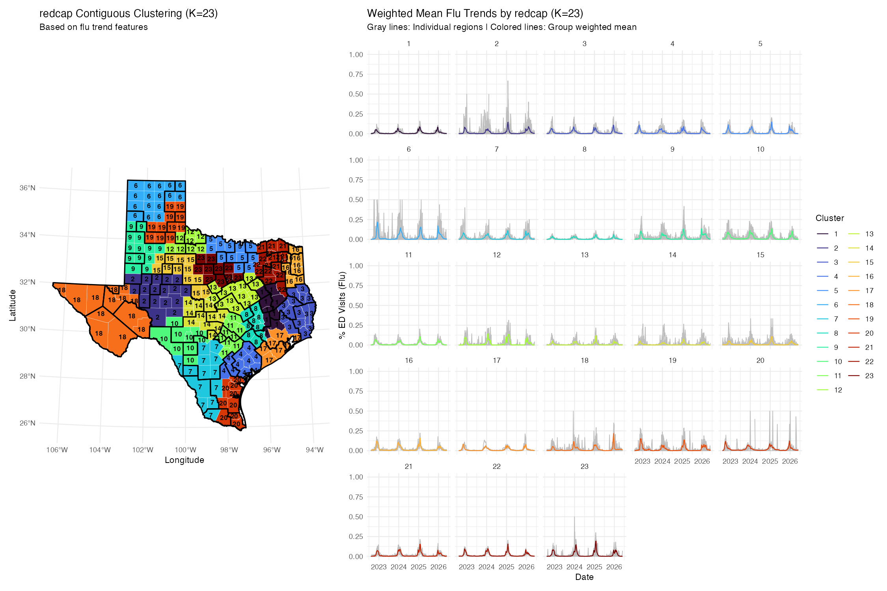

# Augmented County Clustering Results

This report summarizes the county-level augmented clustering runs for influenza
ED visit dynamics in Texas.

Methods included:

- `clustergeoaug`: ClustGeo with augmented flu-dynamics features
- `redcapaug`: REDCAP-style spatially constrained clustering with the same
  augmented flu-dynamics features

Candidate cluster counts:

```text
K = 7, 9, 15, 21, 23, 31, 45, 61
```

Test seasons were handled with leave-one-season-out clustering:

```text
2023/24, 2024/25, 2025/26
```

The clustering files are saved in:

[../data/cluster_data_season](../data/cluster_data_season)

The cluster diagnostic figures are saved in:

[../figures/cluster_combine](../figures/cluster_combine)

---

## Feature Set

Both methods use the same augmented feature matrix. The purpose is to keep the
FPCA representation while adding interpretable epidemic-season characteristics
that may matter for forecasting.

The feature matrix includes:

- Season-wise FPCA scores from smoothed flu ED visit percentage curves
- Mean seasonal incidence
- Peak incidence
- Seasonal burden, calculated as area under the seasonal curve
- Peak week
- Onset week, defined relative to each county-season peak
- Duration above the onset threshold
- Growth slope before peak
- Decline slope after peak
- Mean denominator volume, using total ED visits

Features are standardized before clustering. FPCA and seasonal features are both
weighted as `1` in the current runs.

---

## Method Details

### ClustGeo Augmented

Run label:

```text
clustergeoaug
```

ClustGeo uses a mixed distance:

```text
(1 - alpha) * temporal_feature_distance + alpha * geographic_distance
```

Current setting:

```text
alpha = 0.2
```

Interpretation: most of the distance comes from augmented flu-dynamics features,
while geographic compactness still contributes to the clustering.

### REDCAP Augmented

Run label:

```text
redcapaug
```

The current REDCAP implementation uses augmented flu-dynamics feature distance
with a hard spatial-adjacency penalty. Non-adjacent counties receive a very large
distance penalty before hierarchical clustering is cut at the requested `K`.

Interpretation: REDCAP is more strongly constrained by adjacency structure,
while ClustGeo allows a smoother tradeoff between flu-pattern similarity and
geographic distance.

---

## Spatial Variation Metric

Spatial variation is summarized with `lambda_K`.

```text
lambda_K = 1 - within-region county variation / state-level county variation
```

Higher values mean the regionalization preserves more county-level spatial
heterogeneity. Benchmarks:

- State: `0`
- County: `1`
- DSHS, RAC, and HSA are included as existing boundary comparisons

The reported values are population-weighted and restricted to flu-season months
October through March. Fixed boundary rows such as DSHS, RAC, and HSA are
repeated across candidate cluster files in the raw calculation; their `lambda_K`
values are the relevant comparison values.

---

## Spatial Variation Figures

### ClustGeo Augmented


CSV result:

[../results/spatial_variation_clustergeoaug.csv](../results/spatial_variation_clustergeoaug.csv)

### REDCAP Augmented


CSV result:

[../results/spatial_variation_redcapaug.csv](../results/spatial_variation_redcapaug.csv)

---

## Overall Spatial Variation Table

### Existing Boundaries

| Boundary | K | lambda_K |
|---|---:|---:|
| State | 1 | 0.000 |
| DSHS | 8 | 0.462 |
| RAC | 22 | 0.601 |
| HSA | 61 | 0.754 |
| County | 254 | 1.000 |

### Cluster Methods

| K | ClustGeo Augmented | REDCAP Augmented | ClustGeo - REDCAP |
|---:|---:|---:|---:|
| 7 | 0.364 | 0.327 | 0.037 |
| 9 | 0.390 | 0.363 | 0.027 |
| 15 | 0.512 | 0.492 | 0.020 |
| 21 | 0.581 | 0.523 | 0.059 |
| 23 | 0.590 | 0.540 | 0.050 |
| 31 | 0.646 | 0.565 | 0.081 |
| 45 | 0.705 | 0.661 | 0.044 |
| 61 | 0.744 | 0.694 | 0.049 |

ClustGeo augmented retained more spatial variation than REDCAP augmented for
every tested `K`.

---

## Representative Cluster Region Figures

Each diagnostic figure combines a cluster map with the corresponding cluster
trend plot. The examples below use the `2024/25` excluded season. Full sets for
all seasons and candidate `K` values are available in
[../figures/cluster_combine](../figures/cluster_combine).

### K = 23

ClustGeo augmented:



REDCAP augmented:



### K = 61

ClustGeo augmented:


REDCAP augmented:


---

## Interpretation

From spatial variation alone:

- ClustGeo augmented passes DSHS by `K = 15`.
- ClustGeo augmented is close to RAC by `K = 23`.
- ClustGeo augmented approaches HSA at `K = 61`.
- REDCAP augmented also improves as `K` increases, but it remains below
  ClustGeo augmented for all tested candidate values.

This does not determine the final best `K`. The next step is to compare
forecasting output using WIS for the same candidate `K` values.

Recommended forecasting labels:

```text
clustergeoaug
redcapaug
```

Example:

```bash
python code/forecasting/run_forecast.py \
  --forecast_date 2024-01-06 \
  --method_name clustergeoaug \
  --k_list 7,9,15,21,23,31,45,61 \
  --n_workers 8
```

