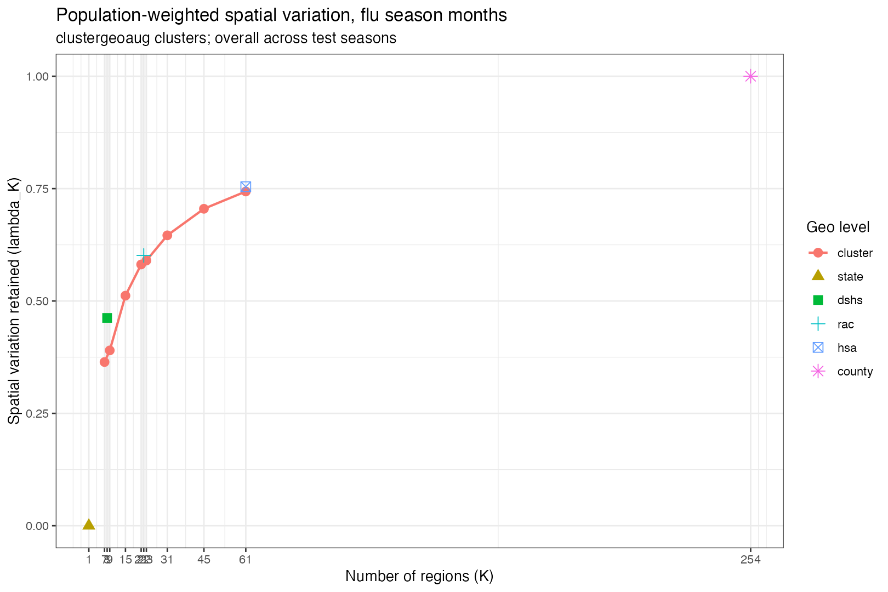
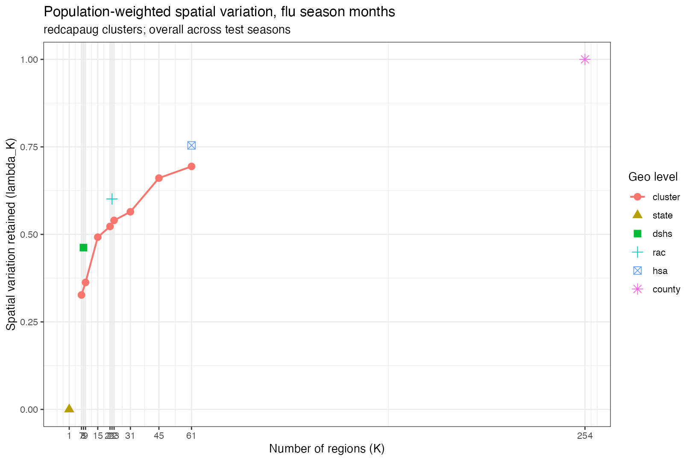
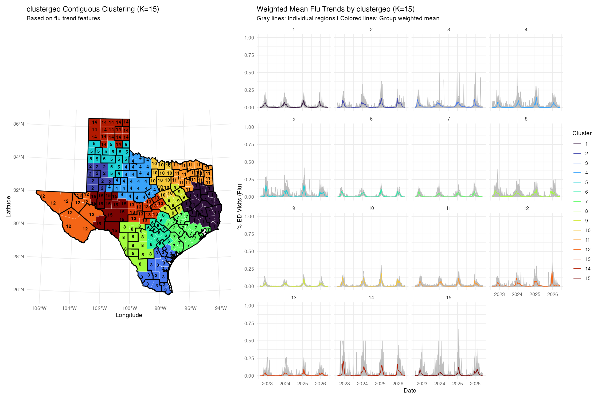
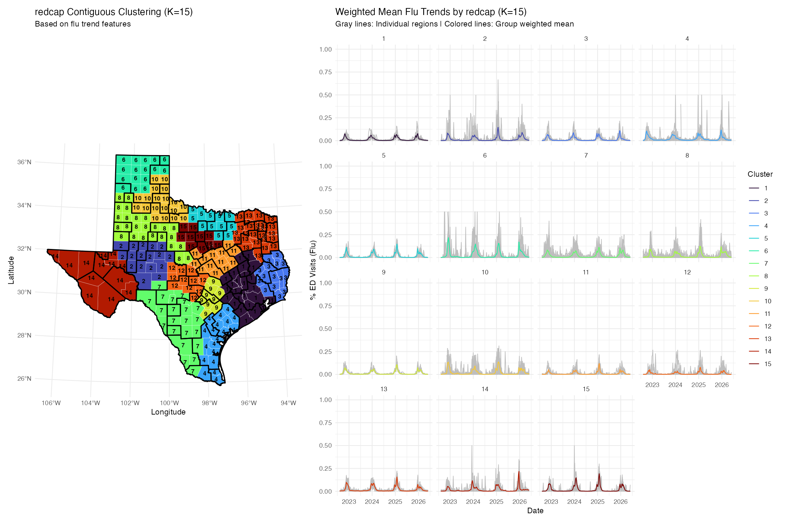
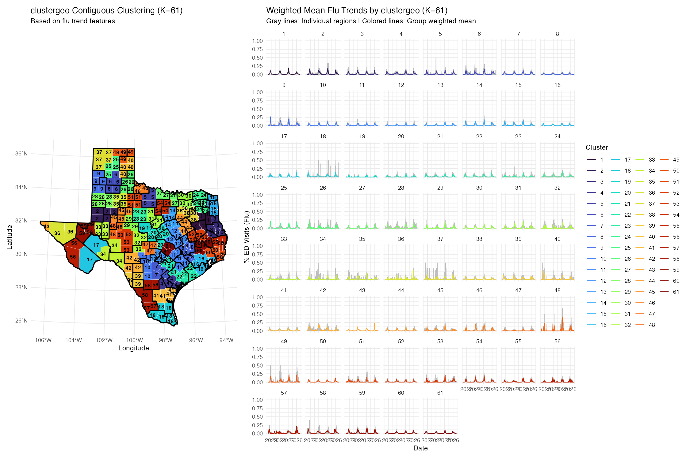
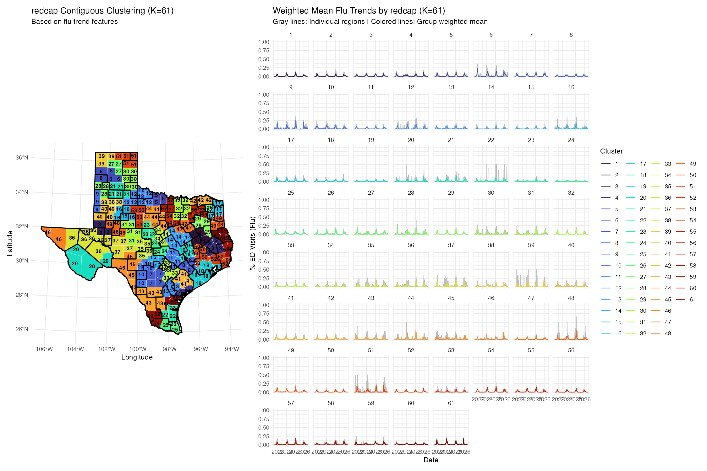

# Clustering Analysis Report

This report defines the clustering analyses to compare for Texas influenza ED
visit dynamics and records the results currently available in this repository.

The selected county cluster counts are:

```text
K = 8, 15, 22, 30, 40, 50, 61, 65
```

The analyses use leave-one-season-out clustering for:

```text
2023/24, 2024/25, 2025/26
```

For example, clusters for the `2024/25` test season are trained without using
`2024/25` data.

---

## Analysis Set

| Analysis ID | Method labels | Spatial method | Feature set | FPCA weight | Seasonal weight | Status |
|---|---|---|---|---:|---:|---|
| A | `clustergeoaug`, `redcapaug` | ClustGeo, REDCAP | augmented FPCA + seasonal features | 1 | 1 | Partly available, but old K list |
| B | `clustergeoaugfpca2`, `redcapaugfpca2` | ClustGeo, REDCAP | augmented FPCA + seasonal features | 2 | 1 | Need to run |
| C | `clustergeofpca`, `redcapfpca` | ClustGeo, REDCAP | FPCA only | 1 | NA | Need to run |
| D | `clustergeofpca2`, `redcapfpca2` | ClustGeo, REDCAP | FPCA only | 2 | NA | Needs code support or will match C |

Important note for Analysis D: the current `cluster_data_by_season.R` only
applies `FPCA_WEIGHT` and `SEASONAL_FEATURE_WEIGHT` when
`FEATURE_SET=augmented`. With `FEATURE_SET=fpca`, the current code ignores those
weights. Therefore, Analysis D will be identical to Analysis C unless the script
is changed to multiply the FPCA-only feature matrix by `FPCA_WEIGHT`.

---

## Methods

### Augmented Feature Matrix

For county `i`, season `s`, and week `t`, let `F` be flu ED visits and `A` be
all ED visits:

$$
y_{i,s,t} = \frac{F_{i,s,t}}{A_{i,s,t}}
$$

A three-week centered rolling mean is used:

$$
\tilde{y}_{i,s,t}
= \frac{y_{i,s,t-1} + y_{i,s,t} + y_{i,s,t+1}}{3}
$$

FPCA summarizes the smoothed trajectory:

$$
\tilde{y}_i(t)
= \mu(t) + \sum_{m=1}^{M} \xi_{i,m}\phi_m(t) + \epsilon_i(t)
$$

The augmented feature vector combines standardized FPCA scores and standardized
seasonal feature summaries:

$$
X_i = [w_f z_i^{FPCA}, w_s z_i^{season}]
$$

Analysis A uses `w_f = 1`, `w_s = 1`. Analysis B uses `w_f = 2`, `w_s = 1`.

### ClustGeo

ClustGeo mixes flu-feature distance and geographic distance:

$$
D_a(i,j) = (1-a)D_0(i,j) + aD_1(i,j)
$$

where `D0` is distance in clustering-feature space and `D1` is county centroid
distance. The current setting is:

$$
a = 0.2
$$

### REDCAP

REDCAP uses the same feature matrix but applies a strong spatial adjacency
constraint. Adjacent counties use the feature distance:

$$
D_R(i,j) = D_0(i,j)
$$

Non-adjacent counties receive a large finite penalty:

$$
D_R(i,j) = M
$$

where:

$$
M = 10000 \max D_0
$$

### Spatial Variation

Spatial variation measures how much county-level heterogeneity is retained by
the regional aggregation.

For county `i`, region `g(i)`, and week `t`:

- `y_i,t`: county flu ED visit proportion
- `y_g(i),t`: regional weighted mean for county `i`
- `y_S,t`: statewide weighted mean
- `w_i`: county population weight

Within-region variation:

$$
W_{R,t} = \sum_i w_i (y_{i,t} - y_{g(i),t})^2
$$

Statewide variation:

$$
W_{S,t} = \sum_i w_i (y_{i,t} - y_{S,t})^2
$$

Retained spatial variation:

$$
\lambda_{K,t} = 1 - \frac{W_{R,t}}{W_{S,t}}
$$

The reported value is averaged across flu-season weeks and test seasons.

---

## Commands To Generate Requested Runs

Use the selected K list for all runs:

```bash
COUNTY_K_LIST=8,15,22,30,40,50,61,65
```

Analysis A, augmented weights 1:1:

```bash
METHOD=clustergeo OUTPUT_METHOD=clustergeoaug FEATURE_SET=augmented \
FPCA_WEIGHT=1 SEASONAL_FEATURE_WEIGHT=1 RUN_LEVELS=county \
COUNTY_K_LIST=8,15,22,30,40,50,61,65 \
Rscript code/clustering/cluster_data_by_season.R

METHOD=redcap OUTPUT_METHOD=redcapaug FEATURE_SET=augmented \
FPCA_WEIGHT=1 SEASONAL_FEATURE_WEIGHT=1 RUN_LEVELS=county \
COUNTY_K_LIST=8,15,22,30,40,50,61,65 \
Rscript code/clustering/cluster_data_by_season.R
```

Analysis B, augmented weights 2:1:

```bash
METHOD=clustergeo OUTPUT_METHOD=clustergeoaugfpca2 FEATURE_SET=augmented \
FPCA_WEIGHT=2 SEASONAL_FEATURE_WEIGHT=1 RUN_LEVELS=county \
COUNTY_K_LIST=8,15,22,30,40,50,61,65 \
Rscript code/clustering/cluster_data_by_season.R

METHOD=redcap OUTPUT_METHOD=redcapaugfpca2 FEATURE_SET=augmented \
FPCA_WEIGHT=2 SEASONAL_FEATURE_WEIGHT=1 RUN_LEVELS=county \
COUNTY_K_LIST=8,15,22,30,40,50,61,65 \
Rscript code/clustering/cluster_data_by_season.R
```

Analysis C, FPCA-only:

```bash
METHOD=clustergeo OUTPUT_METHOD=clustergeofpca FEATURE_SET=fpca \
RUN_LEVELS=county COUNTY_K_LIST=8,15,22,30,40,50,61,65 \
Rscript code/clustering/cluster_data_by_season.R

METHOD=redcap OUTPUT_METHOD=redcapfpca FEATURE_SET=fpca \
RUN_LEVELS=county COUNTY_K_LIST=8,15,22,30,40,50,61,65 \
Rscript code/clustering/cluster_data_by_season.R
```

Analysis D, FPCA-only with FPCA weight 2:

```bash
METHOD=clustergeo OUTPUT_METHOD=clustergeofpca2 FEATURE_SET=fpca \
FPCA_WEIGHT=2 RUN_LEVELS=county COUNTY_K_LIST=8,15,22,30,40,50,61,65 \
Rscript code/clustering/cluster_data_by_season.R

METHOD=redcap OUTPUT_METHOD=redcapfpca2 FEATURE_SET=fpca \
FPCA_WEIGHT=2 RUN_LEVELS=county COUNTY_K_LIST=8,15,22,30,40,50,61,65 \
Rscript code/clustering/cluster_data_by_season.R
```

As noted above, Analysis D currently requires a code change if it should differ
from Analysis C.

---

## Current Result Availability

Only Analysis A currently has spatial-variation results in this repository, and
those results were generated for the earlier K list:

```text
K = 7, 9, 15, 21, 23, 31, 45, 61
```

The current available result files are:

- [../results/spatial_variation_clustergeoaug.csv](../results/spatial_variation_clustergeoaug.csv)
- [../results/spatial_variation_redcapaug.csv](../results/spatial_variation_redcapaug.csv)

The current available summary figures are:

- [../figures/summary/spatial_variation_clustergeoaug.png](../figures/summary/spatial_variation_clustergeoaug.png)
- [../figures/summary/spatial_variation_redcapaug.png](../figures/summary/spatial_variation_redcapaug.png)

### Requested K Availability For Current Analysis A

| Method | K | lambda_K | Status |
|---|---:|---:|---|
| `clustergeoaug` | 8 |  | Missing |
| `redcapaug` | 8 |  | Missing |
| `clustergeoaug` | 15 | 0.512 | Available |
| `redcapaug` | 15 | 0.492 | Available |
| `clustergeoaug` | 22 |  | Missing |
| `redcapaug` | 22 |  | Missing |
| `clustergeoaug` | 30 |  | Missing |
| `redcapaug` | 30 |  | Missing |
| `clustergeoaug` | 40 |  | Missing |
| `redcapaug` | 40 |  | Missing |
| `clustergeoaug` | 50 |  | Missing |
| `redcapaug` | 50 |  | Missing |
| `clustergeoaug` | 61 | 0.744 | Available |
| `redcapaug` | 61 | 0.694 | Available |
| `clustergeoaug` | 65 |  | Missing |
| `redcapaug` | 65 |  | Missing |

---

## Existing Boundary Benchmarks

These are population-weighted overall spatial variation values.

| Boundary | K | lambda_K |
|---|---:|---:|
| State | 1 | 0.000 |
| DSHS | 8 | 0.462 |
| RAC | 22 | 0.601 |
| HSA | 61 | 0.754 |
| County | 254 | 1.000 |

---

## Available Overall Spatial Variation Results

These are the currently available Analysis A results. They are useful as a
baseline, but they do not yet fully match the requested selected K list.

| Method | K | lambda_K |
|---|---:|---:|
| `clustergeoaug` | 7 | 0.364 |
| `redcapaug` | 7 | 0.327 |
| `clustergeoaug` | 9 | 0.390 |
| `redcapaug` | 9 | 0.363 |
| `clustergeoaug` | 15 | 0.512 |
| `redcapaug` | 15 | 0.492 |
| `clustergeoaug` | 21 | 0.581 |
| `redcapaug` | 21 | 0.523 |
| `clustergeoaug` | 23 | 0.590 |
| `redcapaug` | 23 | 0.540 |
| `clustergeoaug` | 31 | 0.646 |
| `redcapaug` | 31 | 0.565 |
| `clustergeoaug` | 45 | 0.705 |
| `redcapaug` | 45 | 0.661 |
| `clustergeoaug` | 61 | 0.744 |
| `redcapaug` | 61 | 0.694 |

### By Test Season

| Test season | Method | K | lambda_K |
|---|---|---:|---:|
| 2023/24 | `clustergeoaug` | 7 | 0.417 |
| 2023/24 | `redcapaug` | 7 | 0.313 |
| 2023/24 | `clustergeoaug` | 9 | 0.441 |
| 2023/24 | `redcapaug` | 9 | 0.324 |
| 2023/24 | `clustergeoaug` | 15 | 0.544 |
| 2023/24 | `redcapaug` | 15 | 0.564 |
| 2023/24 | `clustergeoaug` | 21 | 0.636 |
| 2023/24 | `redcapaug` | 21 | 0.588 |
| 2023/24 | `clustergeoaug` | 23 | 0.641 |
| 2023/24 | `redcapaug` | 23 | 0.613 |
| 2023/24 | `clustergeoaug` | 31 | 0.679 |
| 2023/24 | `redcapaug` | 31 | 0.641 |
| 2023/24 | `clustergeoaug` | 45 | 0.723 |
| 2023/24 | `redcapaug` | 45 | 0.683 |
| 2023/24 | `clustergeoaug` | 61 | 0.764 |
| 2023/24 | `redcapaug` | 61 | 0.717 |
| 2024/25 | `clustergeoaug` | 7 | 0.273 |
| 2024/25 | `redcapaug` | 7 | 0.278 |
| 2024/25 | `clustergeoaug` | 9 | 0.295 |
| 2024/25 | `redcapaug` | 9 | 0.326 |
| 2024/25 | `clustergeoaug` | 15 | 0.450 |
| 2024/25 | `redcapaug` | 15 | 0.393 |
| 2024/25 | `clustergeoaug` | 21 | 0.532 |
| 2024/25 | `redcapaug` | 21 | 0.433 |
| 2024/25 | `clustergeoaug` | 23 | 0.540 |
| 2024/25 | `redcapaug` | 23 | 0.436 |
| 2024/25 | `clustergeoaug` | 31 | 0.597 |
| 2024/25 | `redcapaug` | 31 | 0.455 |
| 2024/25 | `clustergeoaug` | 45 | 0.655 |
| 2024/25 | `redcapaug` | 45 | 0.611 |
| 2024/25 | `clustergeoaug` | 61 | 0.700 |
| 2024/25 | `redcapaug` | 61 | 0.652 |
| 2025/26 | `clustergeoaug` | 7 | 0.403 |
| 2025/26 | `redcapaug` | 7 | 0.390 |
| 2025/26 | `clustergeoaug` | 9 | 0.434 |
| 2025/26 | `redcapaug` | 9 | 0.438 |
| 2025/26 | `clustergeoaug` | 15 | 0.541 |
| 2025/26 | `redcapaug` | 15 | 0.519 |
| 2025/26 | `clustergeoaug` | 21 | 0.575 |
| 2025/26 | `redcapaug` | 21 | 0.547 |
| 2025/26 | `clustergeoaug` | 23 | 0.588 |
| 2025/26 | `redcapaug` | 23 | 0.571 |
| 2025/26 | `clustergeoaug` | 31 | 0.663 |
| 2025/26 | `redcapaug` | 31 | 0.597 |
| 2025/26 | `clustergeoaug` | 45 | 0.738 |
| 2025/26 | `redcapaug` | 45 | 0.689 |
| 2025/26 | `clustergeoaug` | 61 | 0.766 |
| 2025/26 | `redcapaug` | 61 | 0.713 |

---

## Figures

### Spatial Variation Summary

ClustGeo augmented:



REDCAP augmented:



### Representative Cluster Maps

Only K `15` and K `61` from the requested list are currently available for
Analysis A.

ClustGeo augmented, exclude `2024/25`, K `15`:



REDCAP augmented, exclude `2024/25`, K `15`:



ClustGeo augmented, exclude `2024/25`, K `61`:



REDCAP augmented, exclude `2024/25`, K `61`:



---

## Next Results Needed

To complete this report for the requested comparison, generate clustering and
spatial variation for all four analysis IDs and the selected K list.

Expected spatial variation result files:

| Analysis ID | Expected files |
|---|---|
| A | `results/spatial_variation_clustergeoaug.csv`, `results/spatial_variation_redcapaug.csv` |
| B | `results/spatial_variation_clustergeoaugfpca2.csv`, `results/spatial_variation_redcapaugfpca2.csv` |
| C | `results/spatial_variation_clustergeofpca.csv`, `results/spatial_variation_redcapfpca.csv` |
| D | `results/spatial_variation_clustergeofpca2.csv`, `results/spatial_variation_redcapfpca2.csv` |

After those files are generated, this report should be updated with:

- overall spatial variation by method and K
- per-season spatial variation by method and K
- representative cluster maps for K `8`, `15`, `22`, `30`, `40`, `50`, `61`,
  and `65`
- WIS and MWIS tradeoff figures once forecasting outputs are available for the
  same method labels and K values
